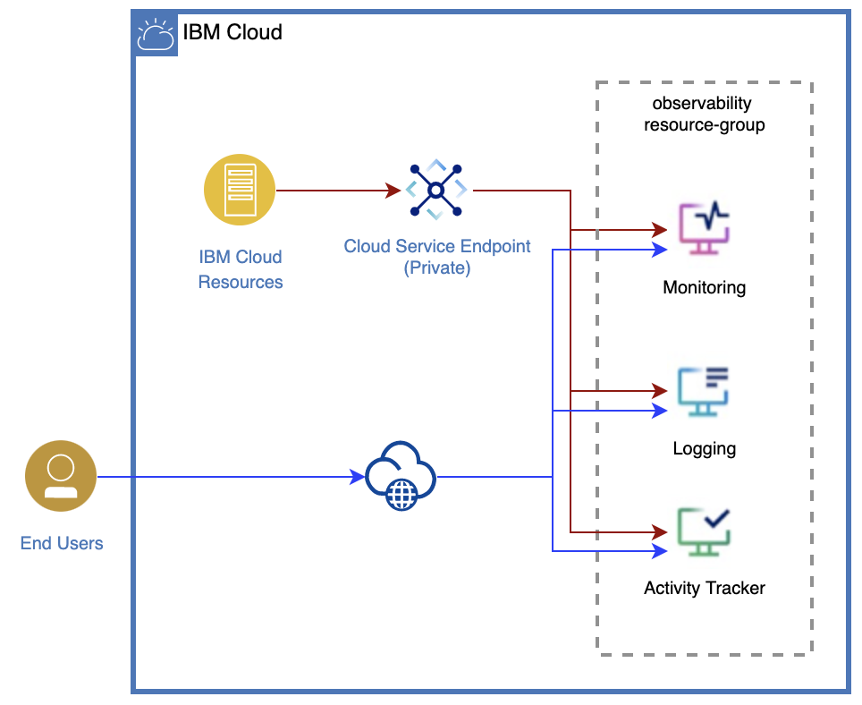

# Module Support for Observability Service.

Observability services - gives you the visibility into the performance and health of your resources on IBM Cloud.  You can use these services to troubleshoot your apps and services, identify threats, detect performance issues, trigger alerts and more.  IBM Cloud offers the following observabilty services, to solve you logging and monitoring needs:

* _IBM Cloud Activity Tracker_ - to gain insights on actions that change the state of a service in the IBM Cloud.
* _IBM Log Analysis_ - to gain insights into your system and application logs.
* _IBM Cloud Monitoring_ - to monitor the health of services and applications in IBM Cloud.

This module is used to provision following observability instances

* Activity Tracker Super Tenant Receiver (ATR)
* Activity Tracker Super Tenant Sender (ATS)
* Logging Super Tenant Receiver (STR)
* Logging Super Tenant Sender (STS)
* Monitoring instance

##  Acronyms

| Acronym         | Full form                               |
|-----------------|-----------------------------------------|
| ATS             | Activity Tracker Super Tenant Sender    |
| ATR             | Activity Tracker Super Tenant Receiver  |
| STS             | Logging Super Tenant Sender             |
| STR             | Logging Super Tenant Receiver           |
| OB              | Observability


The following diagram illustrates the deployment architecture used by this automation.
                          |

## Provision activity tracker ATR instance

```
`atr_provision` = true
```

## Provision ATS activity tracker instance by creating logging STS insatnce
```
  ats_provision              = true
  ats_service_supertenant    = <Name_of_ats_service_supertenant>
  ats_provision_key          = <ats_provision_key>
  ats_associated_logging_crn = <ats_associated_logging_crn>
```

## Provision ATS instance with existing logging STS instance CRN then configure

```
  ats_provision              = true
  ats_service_supertenant    = <Name_of_ats_service_supertenant>
  ats_provision_key          = <ats_provision_key>
  use_existing_sts_crn       = true
```

## Provision Logging STR instance

```
  str_provision = true
```
## Provision Logging STS instance
```
  sts_provision           = true
  sts_service_supertenant = <sts_service_supertenant>
  sts_provision_key       = <sts_provision_key>
```

## Monitoring

To provision monitoring instance

```
`monitoring_provision` = true
```

## Example Usage
```
#####################################################
# Observability
# Copyright 2020 IBM
#####################################################


```hcl
provider "ibm" {
}

data "ibm_resource_group" "rg" {
  name = var.resource_group
}

module "observability" {

  source = "../../"

  ################# Logging Super Tenant Receiver (STR) instance #######################

  str_provision = var.str_provision
  str_logging_bind_key  = var.str_logging_bind_key
  str_logging_plan  = var.str_logging_plan
  str_logging_region = var.str_logging_region
  str_logging_service_endpoints = var.str_logging_service_endpoints
  str_logging_tags = var.str_logging_tags
  str_logging_key_name = var.str_logging_key_name
  str_logging_key_tags = var.str_logging_key_tags

  ################## Logging Super Tenant Sender (STS) Instance ########################
  //STS
  sts_provision           = var.sts_provision
  sts_service_supertenant = var.sts_service_supertenant
  sts_provision_key       = var.sts_provision_key

  //Logging
  sts_logging_bind_key          = var.sts_logging_bind_key
  sts_logging_plan              = var.sts_logging_plan
  sts_logging_region            = var.sts_logging_region
  sts_logging_service_endpoints = var.sts_logging_service_endpoints
  sts_logging_tags              = var.sts_logging_tags
  sts_logging_key_name          = var.sts_logging_key_name
  sts_logging_key_tags          = var.sts_logging_key_tags

  ################# Activity Tracker ATR instance ##########

  atr_provision   = var.atr_provision
  atr_plan = var.atr_plan
  atr_region = var.atr_region
  atr_bind_key = var.atr_bind_key
  atr_key_name = var.atr_key_name
  atr_key_tags = var.atr_key_tags
  atr_tags = var.atr_tags

  ################# Activity Tracker ATS instance ##########

  //ATS
  ats_provision              = var.ats_provision
  ats_service_supertenant    = var.ats_service_supertenant
  ats_provision_key          = var.ats_provision_key
  ats_associated_logging_crn = var.ats_associated_logging_crn
  use_existing_sts_crn       = var.use_existing_sts_crn

  //Activity tracker
  ats_plan      = var.ats_plan
  ats_region    = var.ats_region
  ats_bind_key  = var.ats_bind_key
  ats_key_name  = var.ats_key_name
  ats_key_tags  = var.ats_key_tags
  ats_tags      = var.ats_tags

  ################# Monitoring ############################
  monitoring_provision               = var.monitoring_provision
  monitoring_bind_key                = var.monitoring_bind_key
  monitoring_name                    = var.monitoring_name
  monitoring_plan                    = var.monitoring_plan
  monitoring_region                  = var.monitoring_region
  monitoring_service_endpoints       = var.monitoring_service_endpoints
  monitoring_enable_platform_metrics = var.monitoring_enable_platform_metrics
  monitoring_tags                    = var.monitoring_tags
  monitoring_key_name                = var.monitoring_key_name
  monitoring_key_tags                = var.monitoring_key_tags


  ################ Generic Parameters ######################
  logging_name  = var.logging_name // common for STS and STR
  activity_tracker_name = var.activity_tracker_name //common for ATS and ATR
  resource_group_id = data.ibm_resource_group.rg.id
  create_timeout    = var.create_timeout
  update_timeout    = var.update_timeout
  delete_timeout    = var.delete_timeout
}


```

<!-- BEGINNING OF PRE-COMMIT-TERRAFORM DOCS HOOK -->
## Requirements

| Name | Version |
|------|---------|
| <a name="requirement_terraform"></a> [terraform](#requirement\_terraform) | >=0.13 |

## Modules

| Name | Source | Version |
|------|--------|---------|
| <a name="module_activity-tracker-atr-instance"></a> [activity-tracker-atr-instance](#module\_activity-tracker-atr-instance) | ./modules/activity-tracker-instance | n/a |
| <a name="module_activity-tracker-ats-instance"></a> [activity-tracker-ats-instance](#module\_activity-tracker-ats-instance) | ./modules/activity-tracker-instance | n/a |
| <a name="module_logging_str_instance"></a> [logging\_str\_instance](#module\_logging\_str\_instance) | ./modules/logging-instance | n/a |
| <a name="module_logging_sts_instance"></a> [logging\_sts\_instance](#module\_logging\_sts\_instance) | ./modules/logging-instance | n/a |
| <a name="module_monitoring_instance"></a> [monitoring\_instance](#module\_monitoring\_instance) | ./modules/monitoring-sysdig | n/a |

## Resources

No resources.

## Inputs

| Name | Description | Type | Default | Required |
|------|-------------|------|---------|:--------:|
| <a name="input_activity_tracker_name"></a> [activity\_tracker\_name](#input\_activity\_tracker\_name) | activity tracker Enter the instance name | `string` | n/a | yes |
| <a name="input_atr_bind_key"></a> [atr\_bind\_key](#input\_atr\_bind\_key) | Activity Tracker ATS:  Enable this to bind key to instance (true/false) | `bool` | `false` | no |
| <a name="input_atr_key_name"></a> [atr\_key\_name](#input\_atr\_key\_name) | Activity Tracker ATS:  Name of the instance key | `string` | `null` | no |
| <a name="input_atr_key_tags"></a> [atr\_key\_tags](#input\_atr\_key\_tags) | Activity Tracker ATS: Tags that should be applied to the key | `list(string)` | `null` | no |
| <a name="input_atr_make_default_receiver"></a> [atr\_make\_default\_receiver](#input\_atr\_make\_default\_receiver) | Enable this to make this instance a sdefault receiver | `bool` | `true` | no |
| <a name="input_atr_plan"></a> [atr\_plan](#input\_atr\_plan) | Activity Tracker ATS: The type of plan the service instance should run under (lite, 7-day, 14-day, or 30-day) | `string` | n/a | yes |
| <a name="input_atr_provision"></a> [atr\_provision](#input\_atr\_provision) | Activity Tracker ATR: Disable this not provision ATR instance | `bool` | `true` | no |
| <a name="input_atr_region"></a> [atr\_region](#input\_atr\_region) | Activity Tracker ATS: Geographic location of the resource (e.g. us-south, us-east) | `string` | n/a | yes |
| <a name="input_atr_tags"></a> [atr\_tags](#input\_atr\_tags) | Activity Tracker ATS:  Tags that should be applied to the service | `list(string)` | `null` | no |
| <a name="input_ats_associated_logging_crn"></a> [ats\_associated\_logging\_crn](#input\_ats\_associated\_logging\_crn) | Logging: Enter the associated logging crn | `string` | `null` | no |
| <a name="input_ats_bind_key"></a> [ats\_bind\_key](#input\_ats\_bind\_key) | Activity Tracker ATS:  Enable this to bind key to instance (true/false) | `bool` | `false` | no |
| <a name="input_ats_key_name"></a> [ats\_key\_name](#input\_ats\_key\_name) | Activity Tracker ATS:  Name of the instance key | `string` | `null` | no |
| <a name="input_ats_key_tags"></a> [ats\_key\_tags](#input\_ats\_key\_tags) | Activity Tracker ATS: Tags that should be applied to the key | `list(string)` | `null` | no |
| <a name="input_ats_plan"></a> [ats\_plan](#input\_ats\_plan) | Activity Tracker ATS: The type of plan the service instance should run under (lite, 7-day, 14-day, or 30-day) | `string` | n/a | yes |
| <a name="input_ats_provision"></a> [ats\_provision](#input\_ats\_provision) | Activity Tracker ATS: Disable this to read the existing activity tracker instance | `bool` | `true` | no |
| <a name="input_ats_provision_key"></a> [ats\_provision\_key](#input\_ats\_provision\_key) | Activity Tracker ATS: Provision key | `string` | `""` | no |
| <a name="input_ats_region"></a> [ats\_region](#input\_ats\_region) | Activity Tracker ATS: Geographic location of the resource (e.g. us-south, us-east) | `string` | n/a | yes |
| <a name="input_ats_service_supertenant"></a> [ats\_service\_supertenant](#input\_ats\_service\_supertenant) | Activity Tracker ATS: Name of your supertenant service | `string` | `""` | no |
| <a name="input_ats_tags"></a> [ats\_tags](#input\_ats\_tags) | Activity Tracker ATS:  Tags that should be applied to the service | `list(string)` | `null` | no |
| <a name="input_create_timeout"></a> [create\_timeout](#input\_create\_timeout) | Timeout duration for create. | `string` | `null` | no |
| <a name="input_delete_timeout"></a> [delete\_timeout](#input\_delete\_timeout) | Timeout duration for delete. | `string` | `null` | no |
| <a name="input_enable_platform_logs"></a> [enable\_platform\_logs](#input\_enable\_platform\_logs) | Receive platform logs in LogDNA | `bool` | `true` | no |
| <a name="input_logging_name"></a> [logging\_name](#input\_logging\_name) | Logging Enter the instance name | `string` | n/a | yes |
| <a name="input_monitoring_bind_key"></a> [monitoring\_bind\_key](#input\_monitoring\_bind\_key) | Monitoring: Flag indicating that key should be bind to logdna hippa instance | `bool` | `false` | no |
| <a name="input_monitoring_enable_platform_metrics"></a> [monitoring\_enable\_platform\_metrics](#input\_monitoring\_enable\_platform\_metrics) | Monitoring: Receive platform metrics in Sysdig | `bool` | `true` | no |
| <a name="input_monitoring_key_name"></a> [monitoring\_key\_name](#input\_monitoring\_key\_name) | Monitoring: Name of the instance key | `string` | `null` | no |
| <a name="input_monitoring_key_tags"></a> [monitoring\_key\_tags](#input\_monitoring\_key\_tags) | Monitoring: Tags that should be applied to the key | `list(string)` | `null` | no |
| <a name="input_monitoring_name"></a> [monitoring\_name](#input\_monitoring\_name) | Monitoring Enter the instance name | `string` | n/a | yes |
| <a name="input_monitoring_plan"></a> [monitoring\_plan](#input\_monitoring\_plan) | Monitoring: plan type (graduated-tier, graduated-tier-sysdig-secure-plus-monitor and lite) | `string` | n/a | yes |
| <a name="input_monitoring_provision"></a> [monitoring\_provision](#input\_monitoring\_provision) | Monitoring: Disable this to read the existing activity tracker instance | `bool` | `true` | no |
| <a name="input_monitoring_region"></a> [monitoring\_region](#input\_monitoring\_region) | Monitoring: Provisioning Region | `string` | n/a | yes |
| <a name="input_monitoring_service_endpoints"></a> [monitoring\_service\_endpoints](#input\_monitoring\_service\_endpoints) | Monitoring: Types of the service endpoints. Possible values are 'public', 'private', 'public-and-private'. | `string` | `null` | no |
| <a name="input_monitoring_tags"></a> [monitoring\_tags](#input\_monitoring\_tags) | Monitoring: Tags that should be applied to the service | `list(string)` | `null` | no |
| <a name="input_resource_group_id"></a> [resource\_group\_id](#input\_resource\_group\_id) | Name of the resource group | `string` | n/a | yes |
| <a name="input_str_logging_bind_key"></a> [str\_logging\_bind\_key](#input\_str\_logging\_bind\_key) | Logging STR: Enable this flag to attach a key to STR instance. | `bool` | `false` | no |
| <a name="input_str_logging_key_name"></a> [str\_logging\_key\_name](#input\_str\_logging\_key\_name) | Logging STR: Name of the instance key | `string` | `null` | no |
| <a name="input_str_logging_key_tags"></a> [str\_logging\_key\_tags](#input\_str\_logging\_key\_tags) | Logging STR: Tags that should be applied to the key | `list(string)` | `null` | no |
| <a name="input_str_logging_plan"></a> [str\_logging\_plan](#input\_str\_logging\_plan) | Logging STR: plan type (14-day, 30-day, 7-day, hipaa-30-day and lite) | `string` | n/a | yes |
| <a name="input_str_logging_region"></a> [str\_logging\_region](#input\_str\_logging\_region) | Logging STR: Provisioning Region | `string` | n/a | yes |
| <a name="input_str_logging_service_endpoints"></a> [str\_logging\_service\_endpoints](#input\_str\_logging\_service\_endpoints) | Logging STR: Types of the service endpoints. Possible values are 'public', 'private', 'public-and-private'. | `string` | `null` | no |
| <a name="input_str_logging_tags"></a> [str\_logging\_tags](#input\_str\_logging\_tags) | Logging STR: Tags that should be applied to the service | `list(string)` | `null` | no |
| <a name="input_str_provision"></a> [str\_provision](#input\_str\_provision) | Logging STR: Disable this, not to provision logging STR instance | `bool` | `true` | no |
| <a name="input_sts_logging_bind_key"></a> [sts\_logging\_bind\_key](#input\_sts\_logging\_bind\_key) | Logging STS: Enable this flag to attach a key to STS instance. | `bool` | `false` | no |
| <a name="input_sts_logging_key_name"></a> [sts\_logging\_key\_name](#input\_sts\_logging\_key\_name) | Logging STS: Name of the instance key | `string` | `null` | no |
| <a name="input_sts_logging_key_tags"></a> [sts\_logging\_key\_tags](#input\_sts\_logging\_key\_tags) | Logging STS: Tags that should be applied to the key | `list(string)` | `null` | no |
| <a name="input_sts_logging_plan"></a> [sts\_logging\_plan](#input\_sts\_logging\_plan) | Logging STS: plan type (14-day, 30-day, 7-day, hipaa-30-day and lite) | `string` | n/a | yes |
| <a name="input_sts_logging_region"></a> [sts\_logging\_region](#input\_sts\_logging\_region) | Logging STS: Provisioning Region | `string` | n/a | yes |
| <a name="input_sts_logging_service_endpoints"></a> [sts\_logging\_service\_endpoints](#input\_sts\_logging\_service\_endpoints) | Logging STS: Types of the service endpoints. Possible values are 'public', 'private', 'public-and-private'. | `string` | `null` | no |
| <a name="input_sts_logging_tags"></a> [sts\_logging\_tags](#input\_sts\_logging\_tags) | Logging STS: Tags that should be applied to the service | `list(string)` | `null` | no |
| <a name="input_sts_provision"></a> [sts\_provision](#input\_sts\_provision) | Logging STS: Disable this, not to create STS instance | `bool` | `true` | no |
| <a name="input_sts_provision_key"></a> [sts\_provision\_key](#input\_sts\_provision\_key) | Logging STS: Provision key | `string` | `""` | no |
| <a name="input_sts_service_supertenant"></a> [sts\_service\_supertenant](#input\_sts\_service\_supertenant) | Logging STS: Name of your supertenant service | `string` | `""` | no |
| <a name="input_update_timeout"></a> [update\_timeout](#input\_update\_timeout) | Timeout duration for update. | `string` | `null` | no |
| <a name="input_use_existing_sts_crn"></a> [use\_existing\_sts\_crn](#input\_use\_existing\_sts\_crn) | Enable this to attach existing logging STS instance to activity tracket ATS instance | `bool` | `false` | no |

## Outputs

| Name | Description |
|------|-------------|
| <a name="output_atr_guid"></a> [atr\_guid](#output\_atr\_guid) | The GUID of the activity tracker |
| <a name="output_atr_id"></a> [atr\_id](#output\_atr\_id) | Activity tracker id |
| <a name="output_atr_key_credentials"></a> [atr\_key\_credentials](#output\_atr\_key\_credentials) | Activity tracker key credentials |
| <a name="output_atr_key_guid"></a> [atr\_key\_guid](#output\_atr\_key\_guid) | Activity tracker key guid |
| <a name="output_atr_key_id"></a> [atr\_key\_id](#output\_atr\_key\_id) | Activity tracker key id |
| <a name="output_ats_guid"></a> [ats\_guid](#output\_ats\_guid) | The GUID of the activity tracker |
| <a name="output_ats_id"></a> [ats\_id](#output\_ats\_id) | Activity tracker id |
| <a name="output_ats_key_credentials"></a> [ats\_key\_credentials](#output\_ats\_key\_credentials) | Activity tracker key credentials |
| <a name="output_ats_key_guid"></a> [ats\_key\_guid](#output\_ats\_key\_guid) | Activity tracker key guid |
| <a name="output_ats_key_id"></a> [ats\_key\_id](#output\_ats\_key\_id) | Activity tracker key id |
| <a name="output_monitoring_guid"></a> [monitoring\_guid](#output\_monitoring\_guid) | The GUID of the monitoring |
| <a name="output_monitoring_id"></a> [monitoring\_id](#output\_monitoring\_id) | monitoring id |
| <a name="output_monitoring_key_credentials"></a> [monitoring\_key\_credentials](#output\_monitoring\_key\_credentials) | monitoring key credentials |
| <a name="output_monitoring_key_guid"></a> [monitoring\_key\_guid](#output\_monitoring\_key\_guid) | monitoring key guid |
| <a name="output_monitoring_key_id"></a> [monitoring\_key\_id](#output\_monitoring\_key\_id) | monitoring key id |
| <a name="output_str_logdna_guid"></a> [str\_logdna\_guid](#output\_str\_logdna\_guid) | The GUID of the logdna |
| <a name="output_str_logdna_id"></a> [str\_logdna\_id](#output\_str\_logdna\_id) | logdna id |
| <a name="output_str_logdna_key_credentials"></a> [str\_logdna\_key\_credentials](#output\_str\_logdna\_key\_credentials) | logdna key credentials |
| <a name="output_str_logdna_key_guid"></a> [str\_logdna\_key\_guid](#output\_str\_logdna\_key\_guid) | logdna key guid |
| <a name="output_str_logdna_key_id"></a> [str\_logdna\_key\_id](#output\_str\_logdna\_key\_id) | logdna key id |
| <a name="output_sts_logdna_guid"></a> [sts\_logdna\_guid](#output\_sts\_logdna\_guid) | The GUID of the logdna |
| <a name="output_sts_logdna_id"></a> [sts\_logdna\_id](#output\_sts\_logdna\_id) | logdna id |
| <a name="output_sts_logdna_key_credentials"></a> [sts\_logdna\_key\_credentials](#output\_sts\_logdna\_key\_credentials) | logdna key credentials |
| <a name="output_sts_logdna_key_guid"></a> [sts\_logdna\_key\_guid](#output\_sts\_logdna\_key\_guid) | logdna key guid |
| <a name="output_sts_logdna_key_id"></a> [sts\_logdna\_key\_id](#output\_sts\_logdna\_key\_id) | logdna key id |
<!-- END OF PRE-COMMIT-TERRAFORM DOCS HOOK -->
